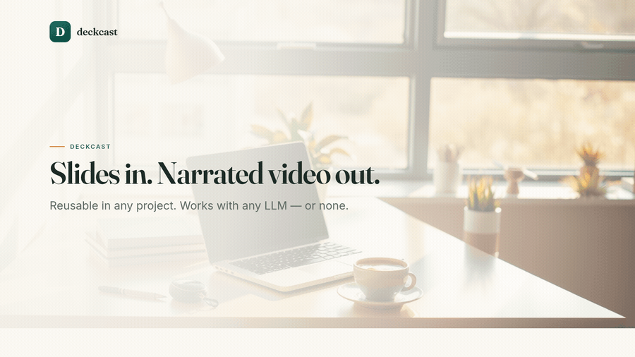

# deckcast

[](https://github.com/aravindcleaerr/deckcast/actions/workflows/ci.yml)
&nbsp;[](LICENSE)

Turn a list of slides into a **narrated MP4** — or a **PPTX / HTML deck** from the same
frames — automated, reusable in any project, and **independent of any specific LLM**.



> *Every slide above was generated by deckcast from a few lines of YAML — images, layout, and all.*

📖 **Full manual:** [GUIDE.md](GUIDE.md) — commands, config reference, providers, troubleshooting, recipes.

It runs a five-step pipeline from one config file:

```
author → images → frames → tts → video
(optional   free      headless   free      ffmpeg
 any LLM)   FLUX      Chrome     edge-tts
```

- **LLM-agnostic.** The optional authoring step (write image prompts + narration from slide
  topics) talks to any **OpenAI-compatible** API — OpenAI, Groq, Together, OpenRouter,
  Mistral, or a **local** model via Ollama / LM Studio. Or skip it entirely and write the
  text yourself: deckcast then needs **no LLM at all**.
- **Free media backends.** Images via Hugging Face FLUX (free token) or Pollinations
  (no key). Voice via Microsoft `edge-tts` neural voices (no key).
- **Two ways to make frames.** `builtin` renders branded slides for you (no external deck
  needed), or `deck` screenshots your own HTML deck.

## Prerequisites

System: **ffmpeg** and **Google Chrome / Chromium** on PATH.
Python: `pip install -r requirements.txt` (or `pip install -e .`).

```bash
deckcast doctor      # verify chrome + ffmpeg + edge-tts are available
```

**Windows note.** Chrome/Edge are auto-detected from their standard install paths, so
they need not be on PATH. `ffmpeg` **and `ffprobe`** do need to be on PATH — grab a build
that ships both (e.g. [gyan.dev](https://www.gyan.dev/ffmpeg/builds/) or
`winget install Gyan.FFmpeg`) and add its `bin` to PATH. The `imageio-ffmpeg` pip package
bundles only `ffmpeg`, not `ffprobe`, so it is **not** sufficient on its own.

## Quickstart

```bash
pip install -e .
export HF_TOKEN=hf_xxx          # free: huggingface.co/settings/tokens  (or use pollinations / none)
deckcast run examples/quickstart.yaml
# -> out/quickstart.mp4
```

Test a single slide while iterating:

```bash
deckcast run examples/quickstart.yaml --only 1
deckcast run examples/quickstart.yaml --steps frames,tts,video   # skip image regen
```

## Autonomous mode — topic in, video out

Give it a one-line brief and the LLM designs the **whole deck** (titles, bullets, image
prompts, narration); deckcast then builds the video.

```bash
export OPENAI_API_KEY=...        # or Groq / OpenRouter / local Ollama (see below)
export HF_TOKEN=hf_xxx           # free images

# write a reviewable deck config from a topic...
deckcast create "investor pitch for a senior-care trust platform, India-first" --slides 9
# ...review/tweak deck.yaml, then:
deckcast run deck.yaml

# or do it all in one shot:
deckcast create "a 6-slide intro to our product" --build
```

You can also keep a config with **just a `brief:`** and no slides — `deckcast run` will
design and build it (see [examples/autonomous.yaml](examples/autonomous.yaml)).

## Config

A deck is a YAML (or JSON) file. Top-level keys: `theme`, `image`, `voice`, `frames`,
`llm`, `video`, and `slides`. Each slide may set:

| Field | Used by | Notes |
|-------|---------|-------|
| `title`, `subtitle`, `eyebrow`, `bullets` | builtin frames | on-slide text |
| `image_prompt` | images | text-to-image prompt (or set `image:` to a file path) |
| `narration` | tts | what the voice says over the slide |
| `topic` | author (LLM) | hint used to auto-write `image_prompt` + `narration` |
| `dark: true` | builtin frames | dark overlay for light text |

If `image_prompt` / `narration` are present, the LLM step is skipped for that slide — so
you can mix hand-written and auto-written slides.

### Using any LLM

```yaml
llm:
  enabled: true
  base_url: "https://api.groq.com/openai/v1"   # or OpenAI / Together / OpenRouter / Ollama
  api_key_env: "GROQ_API_KEY"                   # "" for local providers with no key
  model: "llama-3.3-70b-versatile"
```

### Using your own HTML deck instead of built-in slides

```yaml
frames:
  mode: deck
  deck_path: "docs/MyDeck.html"   # must support ?clean#N (one slide per #index, hides chrome)
```

## Output formats

By default deckcast builds an **MP4**. It can also emit a **PPTX** and a self-contained
**HTML** deck from the very same rendered frames, so all three look identical:

```bash
deckcast run deck.yaml --formats mp4,pptx,html   # all three
deckcast run deck.yaml --formats pptx,html        # decks only — skips voiceover + video
```

Or set it in the config: `formats: [mp4, pptx, html]`.

| Format | What you get | Notes |
|--------|--------------|-------|
| `mp4`  | `output:` (default `out/<name>.mp4`) — 1920×1080 H.264 + AAC, each slide held for the length of its narration | the default |
| `pptx` | one full-bleed 16:9 slide per frame, **narration as speaker notes** | needs `pip install "deckcast[export]"` (python-pptx) |
| `html` | a single self-contained file — arrow-key / click navigation, progress bar, `N` toggles speaker notes, `F` fullscreen, `#sN` deep links | stdlib only; frames are embedded, so the file is self-contained |

When no `mp4` is requested, the `tts` and `video` stages are skipped automatically (decks
need only the frames). Paths default to the `output:` name with a `.pptx` / `.html`
suffix; override with `pptx:` / `html:` keys in the config. Intermediate files live in
`build_deckcast/`.
